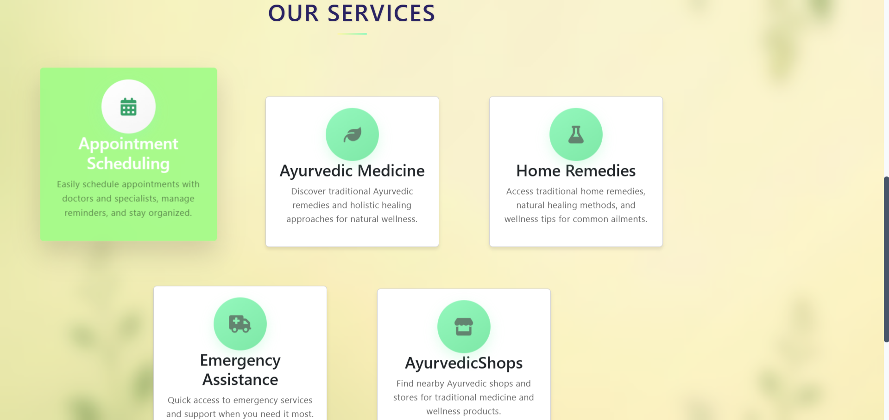
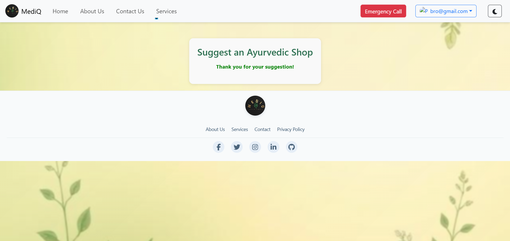
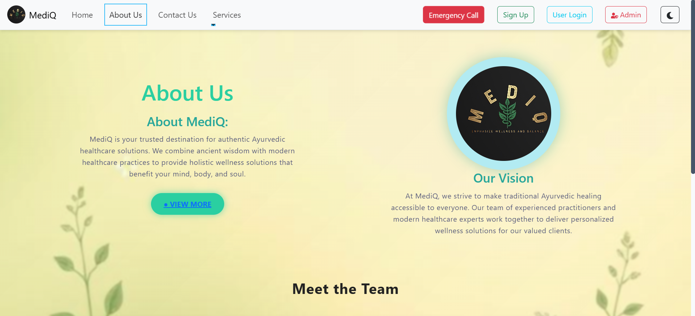

# MediQ 🏥

<div align="center">
  
  <br/>
  <strong>Modern Healthcare Management Platform</strong>
  <br/>
  <em>Empowering your health journey with Ayurvedic wisdom and modern technology</em>
</div>

<div align="center">

[](https://reactjs.org/)
[](https://tailwindcss.com/)
[](https://developer.mozilla.org/en-US/docs/Web/JavaScript)
[](https://app.netlify.com/projects/mediq-health/deploys)

[](https://rajath2005.github.io/mediq.io/)
[](https://github.com/Rajath2005/mediq.io/stargazers)
[](LICENSE)

</div>

---

## 🌟 Overview

MediQ is a comprehensive healthcare management platform that bridges traditional Ayurvedic medicine with modern digital convenience. Built with React and modern web technologies, it provides users with tools to manage appointments, discover Ayurvedic medicines, and access personalized health resources.

## ✨ Key Features

<table>
  <tr>
    <td>🏥</td>
    <td><strong>Appointment Booking</strong><br/>Schedule appointments with healthcare providers</td>
    <td>💊</td>
    <td><strong>Ayurvedic Medicine Database</strong><br/>Comprehensive information on traditional remedies</td>
  </tr>
  <tr>
    <td>🏠</td>
    <td><strong>Home Remedies</strong><br/>Natural solutions for common health issues</td>
    <td>👤</td>
    <td><strong>User Authentication</strong><br/>Secure login and personalized experiences</td>
  </tr>
  <tr>
    <td>🌙</td>
    <td><strong>Dark/Light Mode</strong><br/>Comfortable viewing in any lighting</td>
    <td>📱</td>
    <td><strong>Responsive Design</strong><br/>Seamless experience across all devices</td>
  </tr>
</table>

## 📸 Application Showcase

### 🎨 Theme Options
<div align="center">
  
  <br/>
  
  
  
  
  
  
  <br/>
  <em>Homepage in Light Mode (left) and Dark Mode (right) - Showcasing the dual theme functionality</em>
</div>

### 🔐 Authentication System
<div align="center">
  
  
  
  
  
 
  <br/>
  <em>Secure login and registration system with modern UI design</em>
</div>

### 🏠 Main Dashboard & Navigation
<div align="center">
  
  
  <br/>
  <em>Intuitive dashboard with easy navigation and quick access to key features</em>
</div>

### 🏥 Healthcare Services
<div align="center">
  
  
  <br/>
  <em>Comprehensive healthcare services with detailed information and booking options</em>
</div>

### 💊 Ayurvedic Medicine & Remedies
<div align="center">
 
 
  
  
  
  
  
  
  
  
  
  
  
  <br/>
  <em>Extensive database of Ayurvedic medicines and traditional home remedies</em>
</div>

### 📅 Appointment Management
<div align="center">
  
  
  
  
  
  
  
  
  
  <br/>
  <em>Easy appointment scheduling with calendar integration and real-time availability</em>
</div>

### 👤 User Profile & Settings
<div align="center">

  
  
  <br/>
  <em>Personalized user profiles with customizable settings and health tracking</em>
</div>

### 🔍 Search & Discovery
<div align="center">
  
  
  
  
  
  
  
 
  <br/>
  <em>Advanced search functionality for medicines, remedies, and healthcare providers</em>
</div>

### 📱 Emergency Assistance
<div align="center">
  
  
  
  
  
  
  <br/>
  <em>Quick access to emergency services</em>
</div>

### 📱 Mobile Responsive Design
<div align="center">
  
  <br/>
  <em>Fully responsive design optimized for mobile devices and tablets</em>
</div>

### 📊 Health Analytics & Reports
<div align="center">
  
  <br/>
  <em>Comprehensive health analytics and personalized health reports</em>
</div>

### 💬 Support & Communication
<div align="center">

  
  <br/>
  <em>Multiple support channels including live chat, contact forms, and comprehensive FAQ</em>
</div>

### 🌐 Additional Features
<div align="center">
  
  
  
  
  <br/>
  <em>Rich content pages including team information, blog posts, and newsletter subscription</em>
</div>

## 🚀 Quick Start

```bash
# Clone the repository
git clone https://github.com/Rajath2005/mediq.io.git

# Navigate to project directory
cd mediq.io

# Install dependencies
npm install

# Start development server
npm start
```

Open [http://localhost:3000](http://localhost:3000) to view the application.

## 🛠️ Built With

- **Frontend**: React 18, Tailwind CSS, JavaScript ES6+
- **Styling**: CSS3, Responsive Design
- **Build Tool**: Create React App
- **Deployment**: GitHub Pages

## 📁 Project Structure

```
mediq.io/
├── public/                 # Static assets
├── src/
│   ├── components/         # Reusable UI components
│   │   ├── Appointments/   # Appointment related components
│   │   ├── Profile/        # User profile components
│   │   ├── Settings/       # App settings
│   │   └── images/         # Component images
│   ├── pages/              # Page components
│   │   ├── AboutUs.js      # About page
│   │   ├── Contact.js      # Contact page
│   │   └── ServicesPage.js # Services page
│   └── styles/             # Global styles
├── package.json            # Dependencies and scripts
└── tailwind.config.js      # Tailwind configuration
```

## 🌐 Live Demo

**[Visit MediQ →](https://rajath2005.github.io/mediq.io/)**

Experience the full functionality of our healthcare platform.

## 🎯 Development Status
[](https://app.netlify.com/projects/mediq-health/deploys)

> **Note**: MediQ is currently in active development. New features and improvements are being added regularly.

**Current Features:**
- ✅ User Authentication (Login/Signup)
- ✅ Responsive UI with Dark/Light Mode
- ✅ Basic Appointment Booking Interface
- ✅ Service Information Pages
- ✅ Ayurvedic Medicine Database
- ✅ User Profile Management

**Upcoming Features:**
- 🔄 Advanced Health Analytics
- 🔄 Real-time Chat Support
- 🔄 Telemedicine Integration
- 🔄 Mobile App Development
- 🔄 AI-powered Health Recommendations

## 📋 Available Scripts

| Command | Description |
|---------|-------------|
| `npm start` | Run development server |
| `npm build` | Build for production |
| `npm test` | Run test suite |
| `npm eject` | Eject from Create React App |

## 🤝 Contributing

We welcome contributions! Here's how you can help:

1. Fork the repository
2. Create your feature branch (`git checkout -b feature/AmazingFeature`)
3. Commit your changes (`git commit -m 'Add some AmazingFeature'`)
4. Push to the branch (`git push origin feature/AmazingFeature`)
5. Open a Pull Request

## 📄 License

This project is licensed under the MIT License - see the [LICENSE](LICENSE) file for details.

## 👥 Team

<div align="center">
  <strong>Built with ❤️ by the MediQ Team</strong>
  <br/><br/>
  
  <table>
    <tr>
      <td align="center">
        <a href="https://github.com/Rajath2005">
          <br/>
          <sub><b>Rajath</b></sub>
        </a><br/>
        <sub>Project Lead & Developer</sub>
      </td>
      <td align="center">
        <a href="https://github.com/Sanath00007">
          <br/>
          <sub><b>Sanath</b></sub>
        </a><br/>
        <sub>Frontend Developer</sub>
      </td>
      <td align="center">
        <a href="https://github.com/Rithesh0115">
          <br/>
          <sub><b>Rithesh</b></sub>
        </a><br/>
        <sub>UI/UX Developer</sub>
      </td>
      <td align="center">
        <a href="https://github.com/Sheethal-2005">
          <br/>
          <sub><b>Sheethal</b></sub>
        </a><br/>
        <sub>Developer</sub>
      </td>
    </tr>
  </table>
</div>

## 📞 Support & Contact

- 🌐 **Website**: [MediQ Live Demo](https://rajath2005.github.io/mediq.io/)
- 📧 **Contact**: [Get in Touch](https://rajath2005.github.io/mediq.io/#/contact)
- 🐛 **Issues**: [Report Bug](https://github.com/Rajath2005/mediq.io/issues)
- 💡 **Feature Requests**: [Request Feature](https://github.com/Rajath2005/mediq.io/issues)

---

<div align="center">
  <strong>⭐ If you find MediQ helpful, please give it a star!</strong>
  <br/>
  <em>Your support helps us continue improving healthcare accessibility</em>
</div>
